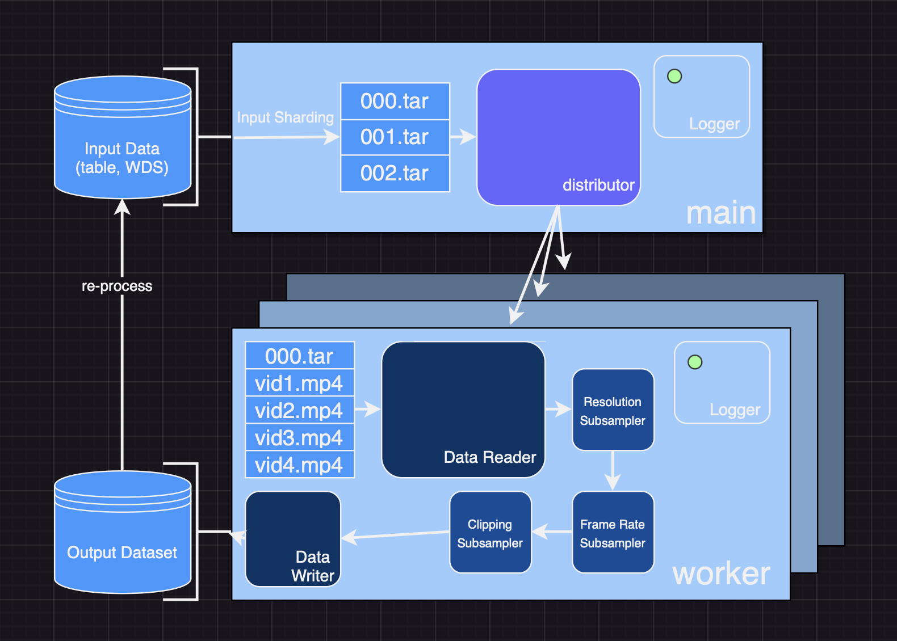

# video2dataset
[](https://pypi.python.org/pypi/video2dataset)

Easily create large video dataset from video urls. Can download and package 10M videos in 12h on a single 16 core machine.



If you believe in making reusable tools to make data easy to use for ML and you would like to contribute, please join the [DataToML](https://discord.gg/ep8yUUtCnp) chat.

If you would like to contribute to video2dataset, please read [CONTRIBUTE.md](CONTRIBUTE.md)

## Install

```bash
pip install video2dataset
```

Or from source via

```bash
git clone https://github.com/iejMac/video2dataset
cd video2dataset
pip install -e .
```

#### Mac Installation


On Mac, replace 'decord' with 'eva_decord' in requirements.txt. For details, see https://github.com/dmlc/decord/issues/213.


## Usage

First get some video urls and metadata (all [supported sites](https://github.com/yt-dlp/yt-dlp/blob/master/supportedsites.md) by yt-dlp). For example lets save this small animal video dataset to a csv file called `videos.csv`
```csv
url,caption
https://www.youtube.com/watch?v=od_PmtmMDV0,Driving to the banana store
https://www.youtube.com/watch?v=8FhGOV7fs64,Polar bear eating
https://www.youtube.com/watch?v=TReCLbmhlMs,Cat scared of printer
https://www.dailymotion.com/video/x29ryo7,Cat and owl playing
```

Then, run the tool:

```bash
video2dataset --url_list="videos.csv" --url_col="url" --caption_col="caption" --output_folder="dataset"
```
If you go into the output folder you should see a nice small video dataset stored with all relevant metadata.

## Examples

Here are some more concrete examples of video2dataset usage.

#### WebVid download

The WebVid dataset is a high quality video-text of 10M stock videos. It can be easily downloaded and stored using [one video2dataset command](https://github.com/iejMac/video2dataset/blob/main/examples/download_webvid.sh), to perform the same on the train split (much larger) you just need to swap out the csv file and update the distribution params to something more beefy. Here's an [example config](https://github.com/iejMac/video2dataset/blob/main/examples/default_slurm.yaml) that adjusts the default config for slurm distribution (so we can use many nodes to download it quickly).

#### Re-processing

video2dataset is designed such that you can chain together runs to re-process your downloaded data since `webdataset` is a valid `input_format`. Here's an example - with the WebVid data you downloaded in the previous example you can also run [this script](https://github.com/iejMac/video2dataset/blob/main/examples/optical_flow_webvid.sh) which will compute the optical flow for each video and store it in metadata shards (shards which only have the optical flow metadata in them). You can also run [this script](https://github.com/iejMac/video2dataset/blob/main/examples/downsample_webvid.sh) which will take those videos and perform resizing, fps downsampling, cut detection, and clipping and also store that in a new dataset. We make sure that the content in shards with the same IDs is the same across re-processing runs. Furthermore, if clipping is not performed shard IDs *and* sample IDs are exactly the same since clipping is the only transformation that changes the sample IDs i.e. if sample `000` is clipped into 3 clips they will be split into `000_000`, `000_001`, `000_002`.

#### Dataloading

Once you download some chunk of WebVid (or any video dataset) you can load it using our dataloader like in [this example](https://github.com/iejMac/video2dataset/blob/main/examples/dataloader_example.py). Try it out.

#### Large processing job examples

Whenever we do a large dataset processing job we document them in [dataset examples](https://github.com/iejMac/video2dataset/tree/main/dataset_examples) as many existing datasets are unique and might require special procesing or the authors just don't specify the best ways of getting the data. Thanks to this we can all share the most efficient ways of processing large video/audio datasets!

## Output format

The tool will automatically download the urls and store them with the format:

```
output-folder
 ├── 00000{.ext if output_format != files, can be tar, parquet, tfrecord, etc.}
 |     ├── 00000.mp4
 |     ├── 00000.txt
 |     ├── 00000.json
 |     ├── 00001.mp4
 |     ├── 00001.txt
 |     ├── 00001.json
 |     └── ...
 |     ├── 10000.mp4
 |     ├── 10000.txt
 |     ├── 10000.json
 ├── 00001.ext
 |     ├── 10001.mp4
 |     ├── 10001.txt
 |     ├── 10001.json
 │     ...
 ...
```

with each number being the position in the input table or the input sample ID. The subfolders avoid having too many files in a single folder. If **captions** are provided, they will be saved as 0.txt, 1.txt, etc. (matching the ID of the sample they belong to). This can then easily be fed into machine learning training or any other use case.

Also .json files named 0.json, 1.json,... are saved with these keys:
* url
* caption
* key of the form 000010005: the first 5 digits are the shard id, the last 4 are the index in the shard
* additionally gathered metadata (either specified from input table or collected during downloading/processing)
* status: whether the download succeeded
* error_message

Also a .parquet file will be saved with the same name as the subfolder/tar files containing these same metadata.
It can be used to analyze the results efficiently.

.json files will also be saved with the same name suffixed by \_stats, they contain stats collected during downloading (download time, number of success, ...)

### Output format choice

video2dataset support several formats. There are trade off for which to choose:
* files: this is the simplest one, videos are simply saved as files. It's good for up to 1M samples on a local file system. Beyond that performance issues appear very fast. Handling more than a million files in standard filesystem does not work well.
* webdataset: webdataset format saves samples in tar files, thanks to [webdataset](https://webdataset.github.io/webdataset/) library, this makes it possible to load the resulting dataset fast in both pytorch, tensorflow and jax. Choose this for most use cases. It works well for any filesystem
* parquet: parquet is a columnar format that allows fast filtering. It's particularly easy to read it using pyarrow and pyspark. Choose this if the rest of your data ecosystem is based on pyspark. [petastorm](https://github.com/uber/petastorm) can be used to read the data but it's not as easy to use as webdataset
* tfrecord: tfrecord is a protobuf based format. It's particularly easy to use from tensorflow and using [tf data](https://www.tensorflow.org/guide/data). Use this if you plan to use the dataset only in the tensorflow ecosystem. The tensorflow writer does not use fsspec and as a consequence supports only a limited amount of filesystem, including local, hdfs, s3 and gcs. It is also less efficient than the webdataset writer when writing to other filesystems than local, losing some 30% performance.


## API

The module exposes a single function `video2dataset` which takes the same arguments as the command line tool:

```
url_list: list of input urls - can be any of the supported input formats
    (csv, parquet, braceexpand tar paths etc.)
output_folder: Desired location of output dataset (default = "dataset")
output_format: Format of output dataset, can be (default = "files")
    - files, samples saved in subdirectory for each shard (useful for debugging)
    - webdataset, samples saved in tars (useful for efficient loading)
    - parquet, sampels saved in parquet (as bytes)
    - tfrecord, samples saved in tfrecord (as bytes)
    - dummy, does not save (useful for benchmarks)
input_format: Format of the input, can be (default = "csv")
    - txt, text file with a url in each line
    - csv, csv file with urls, (and captions + metadata)
    - tsv, tsv - || -
    - tsv.gz, - || - but compressed gzip
    - json, loads urls and metadata as json
    - parquet, loads urls and metadata as parquet
    - webdataset, usually braceexpand format of mutliple paths to tars to re-process
encode_formats: Dict that specifies what extension each modality should use (default = "{'video': 'mp4'}")
    f.e. {"video": "mp4", "audio": "m4a"}
stage: String that tells video2dataset what stage of processing is being performed. Can be (default = 'download')
    WARNING: To be depracated soon (this information should be deduced based on config)
    - download, when input is some tabular format and data must be downloaded first
    - subset, tar files are already written and we would like to re-process (input_format == "webdataset")
    - optical_flow, tar files are written and we woudl like to compute optical_flow and save to md shards
url_col: Column in input (if has columns) that contains the url (default = "url")
caption_col: Column in input (if has columns) that contains captions (to be written as txt) (default = None)
clip_col: Column in input (if has columns) that contains timeframes of clips for how to split video (default = None)
save_additional_columns: List of column names to save to json component of a sample (defualt = None)
enable_wandb: Whether or not to log info to wandb (default = False)
wandb_project: Name of wandb project to log runs to (default = "video2dataset")
incremental_mode: Decides how to handle restarting, Can be (default = "incremental")
    - incremental, checks which shards are done and skips those
    - overwrite, deletes and reprocesses shards as it goes
max_shard_retry: Maximum amount of attempts to retry a failed shard (default = 1)
tmp_dir: Path to temporary directory on your file system (default = "/tmp")
config: Path to your config of choice or the config itself (more info on configs in API doc) (default = "default")
```

These arguments give coarse control over input/output "shape" of the dataset. For finer control of subsamplers, distribution, reading, and storage see the more detailed [API.md](https://github.com/iejMac/video2dataset/blob/main/API.md) doc.

## Downloading YouTube Metadata

If we want to download a large amount of YouTube videos with video2dataset we can specify some parameters and also extract useful metadata as well. For directions on how to do so please see this [example](https://github.com/iejMac/video2dataset/blob/main/examples/yt_metadata.md).

## Incremental mode

If a first download got interrupted for any reason, you can run again with --incremental "incremental" (this is the default) and using the same output folder , the same number_sample_per_shard and the same input urls, and video2dataset will complete the download.

## File system support

Thanks to [fsspec](https://filesystem-spec.readthedocs.io/en/latest/), video2dataset supports reading and writing files in [many file systems](https://github.com/fsspec/filesystem_spec/blob/6233f315548b512ec379323f762b70764efeb92c/fsspec/registry.py#L87).
To use it, simply use the prefix of your filesystem before the path. For example `hdfs://`, `s3://`, `http://`, or `gcs://`.
Some of these file systems require installing an additional package (for example s3fs for s3, gcsfs for gcs).
See fsspec doc for all the details.

If you need specific configuration for your filesystem, you may handle this problem by using the [fsspec configuration system](https://filesystem-spec.readthedocs.io/en/latest/features.html#configuration) that makes it possible to create a file such as `.config/fsspec/s3.json` and have information in it such as:
```json
{
  "s3": {
    "client_kwargs": {
            "endpoint_url": "https://some_endpoint",
            "aws_access_key_id": "your_user",
            "aws_secret_access_key": "your_password"
    }
  }
}
```
Which may be necessary if using s3 compatible file systems such as [minio](https://min.io/). That kind of configuration also work for all other fsspec-supported file systems.

## Distribution modes

video2dataset supports several distributors.
* multiprocessing which spawns a process pool and use these local processes for downloading
* pyspark which spawns workers in a spark pool to do the downloading
* slurm which starts separate worker nodes

multiprocessing is a good option for downloading on one machine, and as such it is the default.
Pyspark lets video2dataset use many nodes, which makes it as fast as the number of machines.
It can be particularly useful if downloading datasets with more than a billion image. Here's an [example](https://github.com/iejMac/video2dataset/blob/main/examples/distributed_spark.md)
for how we used pyspark distributed mode to download 40M videos with metadata. If you have access to a slurm cluster it is more comfortable to use than pyspark but not everyone does.

### pyspark configuration

In order to use video2dataset with pyspark, you will need to do this:
1. `pip install pyspark`
2. set `distributor: pyspark` in your config
3. tweak the `subjob_size: 1000` option in your config. This is the number of videos to download in each subjob. Increasing it will mean a longer time of preparation to put the feather files in the temporary dir, a shorter time will mean sending less shards at a time to the pyspark job.

By default a local spark session will be created.
You may want to create a custom spark session depending on your specific spark cluster.

## Benchmarks

As stated at the top of the README - video2dataset is capable of downloading 10M videos in 12h. For more details on end2end performance please see specific runs in [dataset examples](https://github.com/iejMac/video2dataset/tree/main/dataset_examples) as there are nuances to video (how long it is, where it comes from etc.). For example it takes considerably longer to pul videos from youtube than just mp4 links (compare [WebVid.md](https://github.com/iejMac/video2dataset/tree/main/dataset_examples/WebVid.md) to [VideoCC.md](https://github.com/iejMac/video2dataset/tree/main/dataset_examples/VideoCC.md)). Each example should have a "Performance" statement at the bottom which should contain info about download/processing performance (video/s, Mb/s) along with a cost estimate on popular cloud infrastructure.

For information about video2dataset subsampler speed please check out the [benchmark suite](https://github.com/iejMac/video2dataset/tree/main/benchmark) which contains code that produces performance numbers for subsamplers, over a grid of parameters, on a given architecture. It also contains a json file with some results we produced. This can be used to estimate costs of big runs and also to optimize the subsamplers. NOTE: cost can drastically vary based on chosen subsampler configuration.

## Integration with Weights & Biases

If you pass the `--enable_wandb=True` parameter then performance metrics will be logged to [Weights & Biases](https://wandb.com/)


In addition, most frequent errors are logged for easier debugging


Other features are available:

* logging of environment configuration (OS, python version, CPU count, Hostname, etc)
* monitoring of hardware resources (GPU/CPU, RAM, Disk, Networking, etc)
* custom graphs and reports
* comparison of runs (convenient when optimizing parameters such as number of threads/cpus)

When running the script for the first time, you can decide to either associate your metrics to your account or log them anonymously.

You can also log in (or create an account) before by running `wandb login`.	

## For development

Either locally, or in [gitpod](https://gitpod.io/#https://github.com/iejMac/video2dataset) (do `export PIP_USER=false` there)

Setup a virtualenv:

```bash
python3 -m venv .env
source .env/bin/activate
pip install -e .
```

to run tests:
```bash
pip install -r requirements-test.txt
```
then 
```bash
make lint
make test
```

You can use `make black` to reformat the code

`python -m pytest -x -s -v tests -k "dummy"` to run a specific test

## Citation
```bibtex
@misc{kilian-2023-video2dataset,
  author = {Maciej Kilian, Romain Beaumont, Daniel Mendelevitch, Sumith Kulal, Andreas Blattmann},
  title = {video2dataset: Easily turn large sets of video urls to a video dataset},
  year = {2023},
  publisher = {GitHub},
  journal = {GitHub repository},
  howpublished = {\url{https://github.com/iejMac/video2dataset}}
}
```
